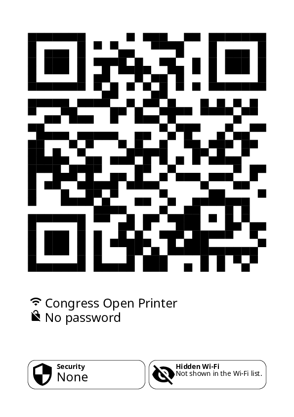

# Wi-Fi print w/ readable (and accessible) password

> WTF! Is it a "big o" or a "zero"? And is it a "big i" or a "little l"? Fuuuuuuuuuu 🤬

If your program does a Wi-Fi card, please, do it well.

This program does it well.

If it does not as well as it pretends, open an issue 😃

## And yours? Does it well?

I try. Here is an example of output:

You can find the PDF [in the example directory](example/example.pdf).

## Features

1. Each char category has a different color. Colors, by default, are made for being differentiated by most of
   color-blind persons. You have also the ability to optimize colors for a kind of color-blindness.
2. Each char which can be confused has a non-confusing glyph. This is useful for color-blind persons... and also if you
   print the PDF in black & white!
3. Spaces in password (see IEEE Std. 802.11i-2004, Annex H.4.1) are explicitly shown.
4. The PDF embed a QR code. This is NOT a raster image: better for all kind of display/print !
5. The QR code embeds the minimum of error correction to be more resilient (squares are bigger ; useful when paper meet
   humidity, you know...)
6. The text and the QR code are as big as possible. This is for same reason as the previous one, but also to be seen (
   and scanned) from a long distance.
7. Texts are available in different languages. If you choose to display texts in a lang, the english translation will
   always be shown. By default, the taken language is the one of the system where the software is run.

## How to use

1. Be sure to have Python >= 3.8 and <= 3.10 & Poetry (else install poetry using pip: `pipx install poetry`).
2. Install the poetry environment (`poetry install --no-dev`).
3. If needed (= if you edit translations, or you haven't taken codebase from a release), compile translations file
   (execute file `poetry run python make.py compile`)
4. Execute `poetry run python main.py cli --help` to discover options. Else, fill a configuration file (based on
   `config.sample.toml`) and execute `poetry run python main.py generate`.

## How to contribute

### Add a translation

Just open an issue with a `.po` file based on the others `.po` files on this repo.

OR (for tech enthusiasts)

Execute the script `make.py collect -l LOCALE_CODE` (e.g.: `make.py collect -l pt_BR`)

## Acknowledgement

All the graphic work (choice of fonts, colors, icons, etc.) have been made by Anne. Find her on different networks:

- https://ombremad.lesbienn.es

(Psssst, hire this very talented person !)

### Kudos to projects we use

Icons are coming from [Material Design Icons](https://github.com/google/material-design-icons).

Fonts we use are :

* NotoSans
* PTMono

## Highlight

> Some times ago, I decided to highlight "unknown" artists on my README files. This is a kind of gift for curious
> peoples who find these files, a kind of temporal capsules !

For this project, I would like to highlight Scarlett.

Scarlett is a very talented artist. She makes awesome music (also, member of the curation crew Couvre x Chefs, lots of
live performances)... and also awesome leather work! Check it out !

- https://www.instagram.com/ohgodscarlett
- https://www.facebook.com/ohgodscarlett
- https://soundcloud.com/ohgodscarlett
- https://open.spotify.com/artist/6etiIEwaPAIpGMoewG0Qso
- https://linktr.ee/ohgodscarlett
